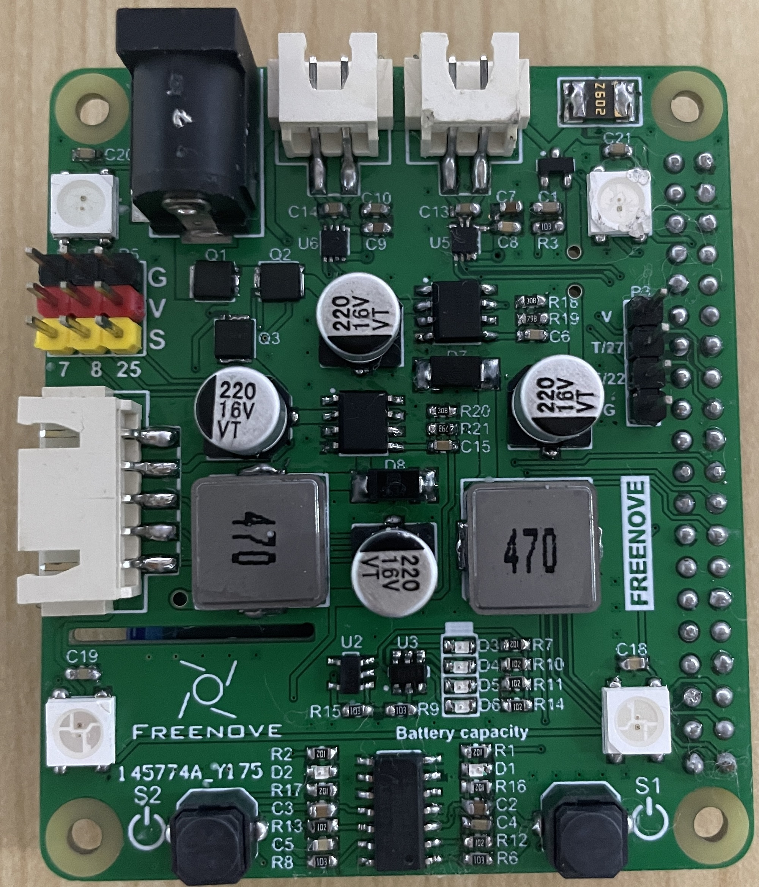
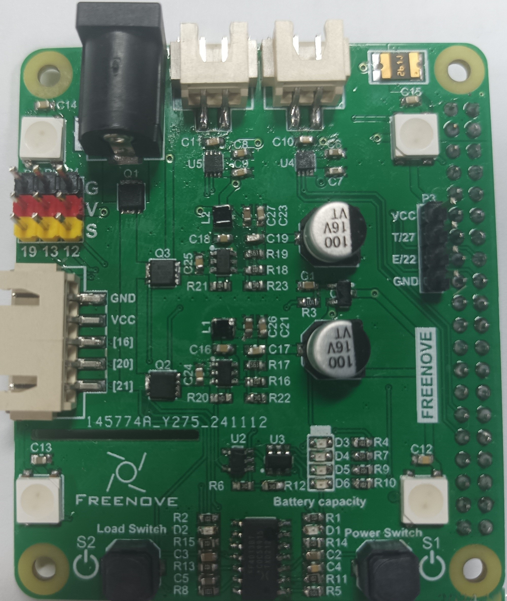

## Freenove Tank Robot Kit for Raspberry Pi

## PCB Version

| PCB Version | PCB Picture |
|-|-|
| V1.0 |  |
| V2.0 |  |

### Download

* **Use command in console**

    Run following command to download all the files in this repository.

    `git clone --depth 1 https://github.com/Freenove/Freenove_Tank_Robot_Kit_for_Raspberry_Pi.git`

* **Manually download in browser**

    Click the green "Clone or download" button, then click "Download ZIP" button in the pop-up window.
    Do NOT click the "Open in Desktop" button, it will lead you to install Github software.

> If you meet any difficulties, please contact our support team for help.

### Differences between PCB versions
| Function | V1.0 | V2.0 |
|-|-|-|
| Servo | GPIO7 (Servo0), GPIO8 (Servo1) | GPIO12 (Servo0), GPIO13 (Servo1) |
| Infrared | GPIO16 (IR01), GPIO20 (IR02), GPIO21 (IR03) | GPIO16 (IR01), GPIO26 (IR02), GPIO21 (IR03) |
| Ultrasonic | GPIO27 (Trig), GPIO22 (Echo) | GPIO27 (Trig), GPIO22 (Echo) |
| LedPixel | GPIO18 | GPIO10 (SPI) |
| Motor | GPIO23 (M1+), GPIO24 (M1-), GPIO6 (M2+), GPIO5 (M2-) | GPIO23 (M1+), GPIO24 (M1-), GPIO6 (M2+), GPIO5 (M2-) |

### Note:

 1. For PCB V1.0, if you are using a Raspberry Pi 4, the code will automatically use the rpi_ws281x library to drive the LED. If you are using a Raspberry Pi 5, the LED cannot be used because the rpi_ws281x library is not supported on the Raspberry Pi 5.
 2. For PCB V1.0, if you are using a Raspberry Pi 4, the code will automatically use the pigpio library to drive the servos. If you are using a Raspberry Pi 5, the code will automatically use the gpiozero library to drive the servos.
 3. For PCB V2.0, hardware SPI is used to drive the LED, and hardware PWM is used to control the servos.
 4. In the Raspberry Pi 5, the pigpio library cannot be used, and some functions of the rpi library are also not available in the bookworm system. Therefore, only the gpiozero library can be used to drive the servos, which may result in imperfect servo performance, occasionally causing jitter.

### Recommendation:

 1. If your PCB version is V1.0, we recommend using it with a Raspberry Pi 4 for better performance. Using a Raspberry Pi 5 is also possible, but the performance will be slightly worse.
 2. If your PCB version is V2.0, we recommend using it with a Raspberry Pi 5 for better performance. Using a Raspberry Pi 4 is also possible, and the performance will be similar to that of the Raspberry Pi 5.

### Support

Freenove provides free and quick customer support. Including but not limited to:

* Quality problems of products
* Using problems of products
* Questions of learning and creation
* Opinions and suggestions
* Ideas and thoughts

Please send an email to:

[support@freenove.com](mailto:support@freenove.com)

We will reply to you within one working day.

### Purchase

Please visit the following page to purchase our products:

http://store.freenove.com

Business customers please contact us through the following email address:

[sale@freenove.com](mailto:sale@freenove.com)

### Copyright

All the files in this repository are released under [Creative Commons Attribution-NonCommercial-ShareAlike 3.0 Unported License](http://creativecommons.org/licenses/by-nc-sa/3.0/).

This means you can use them on your own derived works, in part or completely. But NOT for the purpose of commercial use.
You can find a copy of the license in this repository.

Freenove brand and logo are copyright of Freenove Creative Technology Co., Ltd. Can't be used without formal permission.

### About

Freenove is an open-source electronics platform.

Freenove is committed to helping customers quickly realize creative ideas and product prototypes, making it easy to get started for enthusiasts of programming and electronics and launching innovative open source products.

Our services include:

* Robot kits
* Learning kits for Arduino, Raspberry Pi, and micro:bit
* Electronic components and modules, tools
* Product customization service

Our code and circuit are open source. You can obtain the details and the latest information through visiting the following website:

http://www.freenove.com