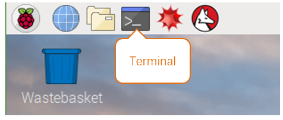
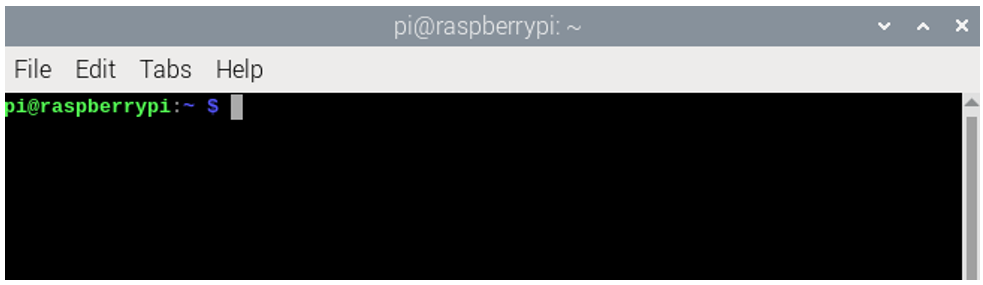
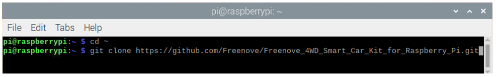
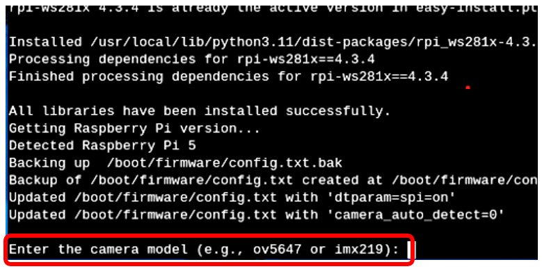
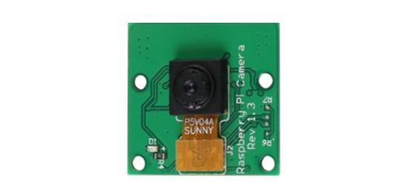
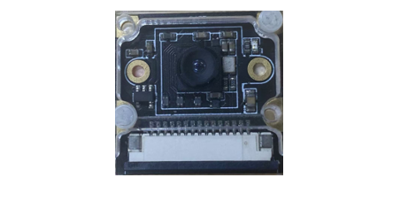
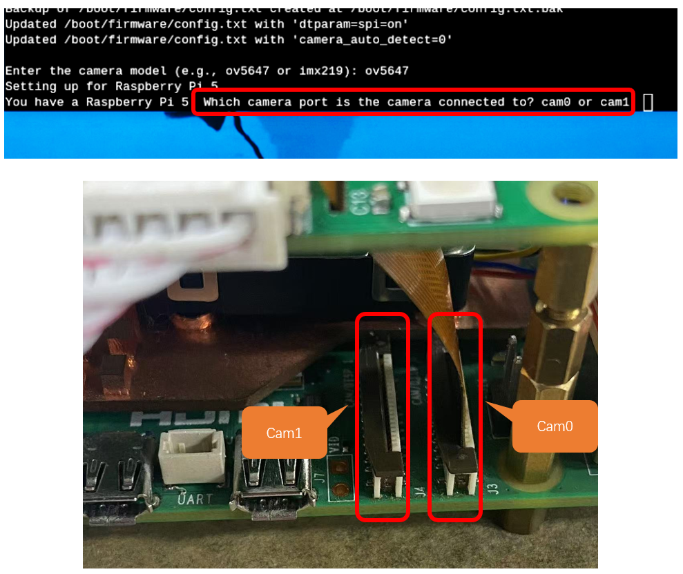
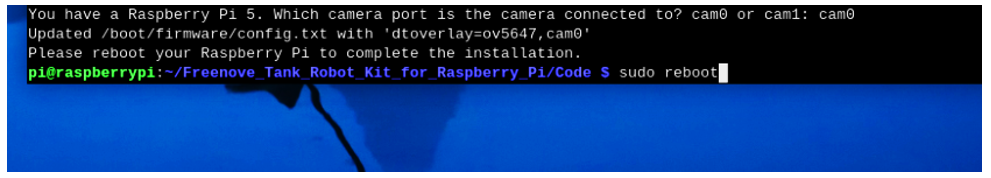

##############################################################################
Chapter 1 Software installation and Test (necessary) 
##############################################################################

If you have any concerns, please feel free to contact us via support@freenove.com

In this chapter, we will make some necessary preparation: start your Pi Raspberry and install some necessary libraries. Then test some parts. Batteries are needed when driving peripherals such as motors, servos, LEDs, etc.

:red:`Note:`

:red:`1, Please use Raspberry Pi OS with Desktop`

2, The installation of libraries takes much time. `You can power Raspberry Pi with a power supply Cable.`

3, If you are using **remote desktop** to login Raspberry Pi, you need to use :ref:`VNC viewer <fnk0077/codes/tutorial/0_raspberry_pi_preparation:vnc viewer & vnc>`

Step 1 Obtain the Code
*********************************************

To download the code, you can power Raspberry Pi with a power supply cable or switch on S1 (Power Switch). Then open the Raspberry Pi and the terminal. You can open the terminal by clicking as shown below, or you can press “CTRL + ALT + T” on the desktop.

The terminal is shown below:

Open the terminal and type the following commands to obtain the car code. And the code will be placed in the directory "Pi". :red:`(Note: Here are two commands. Please execute them in order.)`

.. code-block:: console
    
    cd ~
    git clone --depth 1 https://github.com/Freenove/Freenove_Tank_Robot_Kit_for_Raspberry_Pi.git

Downloading takes some time. Please wait with patience. 

You can also find and download the code by visiting our official website (http://www.freenove.com) or our GitHub repository (https://github.com/freenove).

:red:`If you have never learned python before, you can learn some basics through the following link:`

https://python.swaroopch.com/basics.html

Step2 Install the Needed Libraries
*********************************************

We have wrriten a Python script for you to install all dependency libraries automatically.

1.	Change the root.

.. code-block:: console
    
    sudo chmod 755 -R ~/Freenove_Tank_Robot_Kit_for_Raspberry_Pi

2.	Execute following commands to enter directory of “setup.py”.

.. code-block:: console
    
    cd ~/Freenove_Tank_Robot_Kit_for_Raspberry_Pi/Code

3.	Run setup.py

.. code-block:: console
    
    sudo python setup.py

If it is your first time to run the script, it will ask you to input the camera type. At this point, input the content according to the camera you have. (The one included in this kit is of the type ov5647).

+----------------+----------------+
| OV5670         | Imx219         |
|                |                |
| |Chapter01_06| | |Chapter01_07| |
+----------------+----------------+

If your Rpi is a Pi 5, it will ask you which camera interface to use. You can type in cam0 or cam1 based on the interface you want to use.

.. note:: 
    
    :red:`Make sure you connect the camera cable to the corresponding interface.`

If it is not Raspberry Pi, this setting is not needed, as there is only camera interface available.

Reboot your Raspberry Pi after installing the libraries.

.. code-block:: console
    
    sudo reboot

:red:`The reboot of the pi takes some time, please wait with patience.`

If the installation fails, please rerun setup.py. After the installation is completed, restart the Raspberry Pi. Most installation failures are caused by network reasons.

.. code-block:: console
    
    sudo python setup.py