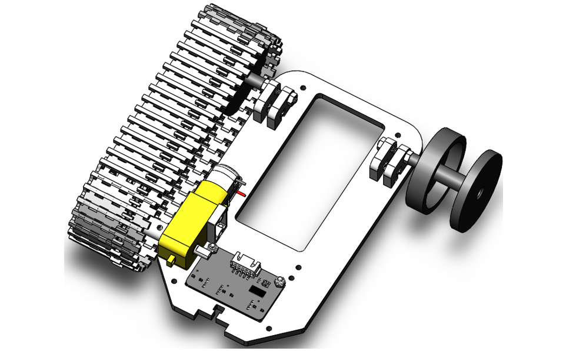
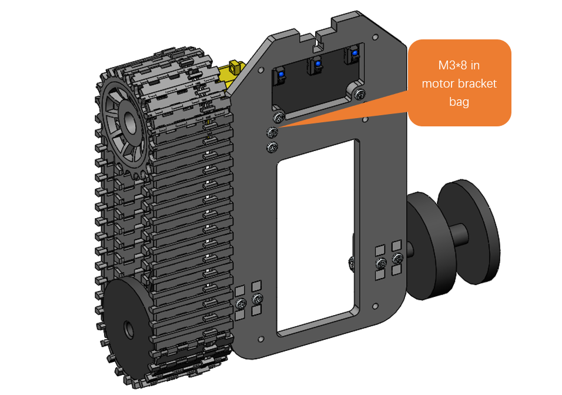
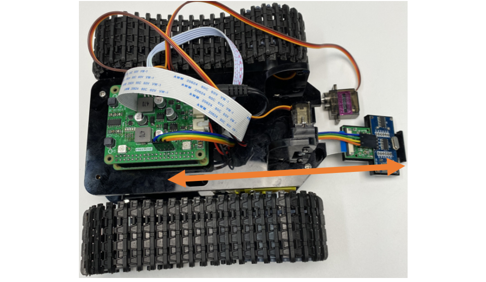

##############################################################################
Chapter 2 Assemble Smart Car 
##############################################################################

If you have any concerns, please feel free to contact us via support@freenove.com

+----------------------------------------------------------------------------------------------------------------+
| Step 1 Install line tracking sensor.                                                                           |
|                                                                                                                |
| Secure the line tracking sensor to the acrylic using two M3X12 screws and two M3 nuts.                         |
|                                                                                                                |
| |Chapter02_00|                                                                                                 |
+----------------------------------------------------------------------------------------------------------------+
| Step 2                                                                                                         |
|                                                                                                                |
| Attach four acrylic support frames to the acrylic using four M3X12 screws and four M3 nuts. Note the           |
|                                                                                                                |
| position of the round holes in the acrylic support frame.                                                      |
|                                                                                                                |
| |Chapter02_01|                                                                                                 |
|                                                                                                                |
| It looks like below after assembled                                                                            |
|                                                                                                                |
| |Chapter02_02|                                                                                                 |
+----------------------------------------------------------------------------------------------------------------+
| Step 3                                                                                                         |
|                                                                                                                |
| Using a Half Tooth Screw M4*50 and an M4 nut, assemble the drive wheel as shown below.                         |
|                                                                                                                |
| |Chapter02_03|                                                                                                 |
|                                                                                                                |
| :red:`Same steps to assemble the other drive wheel.`                                                           |
+----------------------------------------------------------------------------------------------------------------+
| Step 4                                                                                                         |
|                                                                                                                |
| Secure the driving wheel to the acrylic support frame using 2 M4 nuts.                                         |
|                                                                                                                |
| |Chapter02_04|                                                                                                 |
+----------------------------------------------------------------------------------------------------------------+
| Step 5                                                                                                         |
|                                                                                                                |
| There is a special fixed bracket to fix motor, which contains an aluminum bracket, two M3*30                   |
| screws, two                                                                                                    |
|                                                                                                                |
| M3*8 screws, and two M3 nuts, as shown below:                                                                  |
|                                                                                                                |
| Use 2 M3x30 screws and 2 M3 nuts.                                                                              |
|                                                                                                                |
| :red:`Do NOT remove the cable tie on the motor!`                                                               |
|                                                                                                                |
| |Chapter02_05|                                                                                                 |
+----------------------------------------------------------------------------------------------------------------+
| Step 6 Connect coupling with motor.                                                                            |
|                                                                                                                |
| Use an M3x8 screw to connect coupling with motor. (Use the screw in the M3x8 screw bag.)                       |
|                                                                                                                |
| |Chapter02_06|                                                                                                 |
+----------------------------------------------------------------------------------------------------------------+
| Step 7                                                                                                         |
|                                                                                                                |
| Attach the track driver to the motor using an M3x8 screw. (Use the screw in the M3x8 screw bag.))              |
|                                                                                                                |
| |Chapter02_07|                                                                                                 |
+----------------------------------------------------------------------------------------------------------------+
| Step 8                                                                                                         |
|                                                                                                                |
| Put the track on as shown in the picture below.                                                                |
|                                                                                                                |
| |Chapter02_08|                                                                                                 |
|                                                                                                                |
| Use two M3x8 screws from the motor bracket bag at the bottom to hold the motor in place.                       |
|                                                                                                                |
| |Chapter02_09|                                                                                                 |
+----------------------------------------------------------------------------------------------------------------+
| Step 9 With the same steps, install the motor and track on the other side.                                     |
|                                                                                                                |
| |Chapter02_10|                                                                                                 |
+----------------------------------------------------------------------------------------------------------------+
| Step 10                                                                                                        |
|                                                                                                                |
| Attach the camera and ultrasound to the acrylic using eight M1.4x5 screws.                                     |
|                                                                                                                |
| |Chapter02_11|                                                                                                 |
|                                                                                                                |
| :red:`If they cannot be installed, please flip the acrylic board. The hole sizes are different on two sides.`  |
+----------------------------------------------------------------------------------------------------------------+
| Step 11                                                                                                        |
|                                                                                                                |
| Mount the camera and ultrasound onto the acrylic using one M3x12 screw and one M3 nut.                         |
|                                                                                                                |
| |Chapter02_12|                                                                                                 |
+----------------------------------------------------------------------------------------------------------------+
| Step 12                                                                                                        |
|                                                                                                                |
| Use four M3x8 screws to fix four M3x24 standoff onto the acrylic.                                              |
|                                                                                                                |
| |Chapter02_13|                                                                                                 |
+----------------------------------------------------------------------------------------------------------------+
| Step 13                                                                                                        |
|                                                                                                                |
| Use 4 M3x10 screws and 4 M3 nuts to secure the battery case to another piece of acrylic.                       |
|                                                                                                                |
| |Chapter02_14|                                                                                                 |
+----------------------------------------------------------------------------------------------------------------+
| Step 14                                                                                                        |
|                                                                                                                |
| Attach 4 M2.5x6+6 screws to the other side of the acrylic using 4 M2.5x7 screws.                               |
|                                                                                                                |
| |Chapter02_15|                                                                                                 |
+----------------------------------------------------------------------------------------------------------------+
| Step 15                                                                                                        |
|                                                                                                                |
| Using 2 M3x12 screws and 2 M3 nuts, secure the two acrylic connectors to the acrylic sheet. Please note        |
|                                                                                                                |
| that the shape of the acrylic is not the same, and their position is fixed.                                    |
|                                                                                                                |
| |Chapter02_16|                                                                                                 |
+----------------------------------------------------------------------------------------------------------------+
| Step 16                                                                                                        |
|                                                                                                                |
| Attach an M4x10 Rivet to the acrylic as shown in the image below.                                              |
|                                                                                                                |
| |Chapter02_17|                                                                                                 |
+----------------------------------------------------------------------------------------------------------------+
| Step 17                                                                                                        |
|                                                                                                                |
| Using 2 M2x20 screws and 2 M2 nuts, attach the Opaque Black Servo and 2 acrylics to the bottom acrylic.        |
|                                                                                                                |
| Servo shaft is below.                                                                                          |
|                                                                                                                |
| |Chapter02_18|                                                                                                 |
|                                                                                                                |
| The installation is complete as shown in the following figure.                                                 |
|                                                                                                                |
| |Chapter02_19|                                                                                                 |
+----------------------------------------------------------------------------------------------------------------+
| Step 18                                                                                                        |
|                                                                                                                |
| Install Raspberry PI.                                                                                          |
|                                                                                                                |
| |Chapter02_20|                                                                                                 |
+----------------------------------------------------------------------------------------------------------------+
| Step 19                                                                                                        |
|                                                                                                                |
| Install 4 M2.5x11 standoff onto the Raspberry PI.                                                              |
|                                                                                                                |
| |Chapter02_21|                                                                                                 |
+----------------------------------------------------------------------------------------------------------------+
| Step 20 Conect camera.                                                                                         |
|                                                                                                                |
| :red:`The CSI camera must be connected or disconnected under no power and when Raspberry Pi is shut`           |
|                                                                                                                |
| :red:`down, or the camera may be burned.` The board was attached to the Raspberry PI using four M3x8           |
|                                                                                                                |
| screws.                                                                                                        |
|                                                                                                                |
| |Chapter02_22|                                                                                                 |
|                                                                                                                |
| |Chapter02_23|                                                                                                 |
|                                                                                                                |
| Pay attention to the :blue:`Blue bar` of cable.                                                                |
|                                                                                                                |
| |Chapter02_24|                                                                                                 |
|                                                                                                                |
| :red:`Attention for Pi 5 users: As we have set the camera interface when installing the libraries in the`      |
|                                                                                                                |
| :red:`previous chapter, please connect the camera to the corresponding interface.`                             |
|                                                                                                                |
| |Chapter02_25|                                                                                                 |
|                                                                                                                |
| If you want to change the interface, please repeat the library installation steps to set another interface.    |
|                                                                                                                |
| Pay attention to the :blue:`Blue bar` of cable.                                                                |
+----------------------------------------------------------------------------------------------------------------+
| Step 21 Install the upper and lower acrylic sheets together using four M3x8 screws.                            |
|                                                                                                                |
| |Chapter02_26|                                                                                                 |
|                                                                                                                |
| Note: The images of the car board may look different from the one you receive (V1.0 or V2.0). By the way,      |
|                                                                                                                |
| the interface design of the two version is the same, so the operation on them are the same. You can just       |
|                                                                                                                |
| follow this book to use it.                                                                                    |
|                                                                                                                |
| |Chapter02_27|                                                                                                 |
+----------------------------------------------------------------------------------------------------------------+
| Step 22 Install the battery according to the battery box instructions.                                         |
|                                                                                                                |
| |Chapter02_28|                                                                                                 |
|                                                                                                                |
| Turn on the switch of battery holder.                                                                          |
|                                                                                                                |
| |Chapter02_29|                                                                                                 |
+----------------------------------------------------------------------------------------------------------------+
| Step 23 Complete other wiring.                                                                                 |
|                                                                                                                |
| |Chapter02_30|                                                                                                 |
|                                                                                                                |
| |Chapter02_31|                                                                                                 |
|                                                                                                                |
| **The servo wiring varies on the two board versions.**                                                         |
|                                                                                                                |
| **If your board is Version 1.0, please connect as shown below:**                                               |
|                                                                                                                |
| |Chapter02_32|                                                                                                 |
|                                                                                                                |
| **If it is version 2.0, connect in the following way.**                                                        |
|                                                                                                                |
| |Chapter02_33|                                                                                                 |
+----------------------------------------------------------------------------------------------------------------+
| Step 24 Make servo rotate to 90°.                                                                              |
|                                                                                                                |
| Turn on the two switches.                                                                                      |
|                                                                                                                |
| |Chapter02_34|                                                                                                 |
|                                                                                                                |
| Execute following commands in terminal one by one.                                                             |
|                                                                                                                |
| assembling the servos, please perform the following steps to adjust the servos to appropriate angles;          |
|                                                                                                                |
| otherwise it will affect the final effect.                                                                     |
|                                                                                                                |
| 1.Run the following command to enter the directory                                                             |
|                                                                                                                |
|   Freenove_Tank_Robot_Kit_for_Raspberry_Pi/Code/Server                                                         |
|                                                                                                                |
|   **cd ~/Freenove_Tank_Robot_Kit_for_Raspberry_Pi/Code/Server/**                                               |
|                                                                                                                |
| |Chapter02_35|                                                                                                 |
|                                                                                                                |
| 2.Run the following command the current directory.                                                             |
|                                                                                                                |
|   **sudo python servo.py**                                                                                     |
|                                                                                                                |
| If your Raspberry pie is not Pi5 and your PCB version is V1.0, run the following command before                |
|                                                                                                                |
| running the servo.py.                                                                                          |
|                                                                                                                |
| **sudo pigpiod**                                                                                               |
|                                                                                                                |
| If you want to end the pigpio process, run the following command.                                              |
|                                                                                                                |
| **sudo killall pigpiod**                                                                                       |
|                                                                                                                |
| |Chapter02_36|                                                                                                 |
|                                                                                                                |
| Result:                                                                                                        |
|                                                                                                                |
| The two servos will spin to the designated angles. If the servos are already at that position, nothing will be |
|                                                                                                                |
| observed upon running the code.                                                                                |
|                                                                                                                |
| :red:`Keep the program running during the servo assembly process to avoid assembly offset.`                    |
+----------------------------------------------------------------------------------------------------------------+
| Step 26                                                                                                        |
|                                                                                                                |
| Install using the screws in the Servo package as shown below.                                                  |
|                                                                                                                |
| |Chapter02_37|                                                                                                 |
|                                                                                                                |
| Install only after Servo has been rotated to a specified Angle.                                                |
+----------------------------------------------------------------------------------------------------------------+
| Step 27 Mount the acrylic lever to the trolley using 2 sets of M4x10 Rivet.                                    |
|                                                                                                                |
| |Chapter02_38|                                                                                                 |
+----------------------------------------------------------------------------------------------------------------+
| Step 28                                                                                                        |
|                                                                                                                |
| Using 2 M3x12 screws and 2 M3 nuts, install the acrylic as shown below.                                        |
|                                                                                                                |
| |Chapter02_39|                                                                                                 |
+----------------------------------------------------------------------------------------------------------------+
| Step 29 Install using 4 M4x10 rivets as shown below.                                                           |
|                                                                                                                |
| |Chapter02_40|                                                                                                 |
+----------------------------------------------------------------------------------------------------------------+
| Step 30 Install the structure of the previous step on the trolley. :red:`Note the direction of the structure.` |
|                                                                                                                |
| |Chapter02_41|                                                                                                 |
+----------------------------------------------------------------------------------------------------------------+
| Step 31                                                                                                        |
|                                                                                                                |
| Install the clear black steering gear to the trolley using 2 M2x20 screws and 2 M2 nuts.                       |
|                                                                                                                |
| :red:`Notice that the Servo axis of rotation is on the left.`                                                  |
|                                                                                                                |
| |Chapter02_42|                                                                                                 |
+----------------------------------------------------------------------------------------------------------------+
| Step 32 Using 2 M2x20 screws and 2 M2 nuts, secure the three acrylics together. At the same time, install      |
|                                                                                                                |
| using the steering wheel and screws in the Servo package as shown below.                                       |
|                                                                                                                |
| |Chapter02_43|                                                                                                 |
+----------------------------------------------------------------------------------------------------------------+
| Step 33                                                                                                        |
|                                                                                                                |
| Install using the screws in the Servo package as shown below.                                                  |
|                                                                                                                |
| |Chapter02_44|                                                                                                 |
|                                                                                                                |
| Install only after Servo has been rotated to a specified Angle.                                                |
|                                                                                                                |
| You can press “Ctrl+C” to end the servo.py program after finishing servo assembly.                             |
+----------------------------------------------------------------------------------------------------------------+
| Step 34 Use two M3x8 screws to fix two M3x10 standoff into the acrylic.                                        |
|                                                                                                                |
| |Chapter02_45|                                                                                                 |
+----------------------------------------------------------------------------------------------------------------+
| Step 35 Using 2 M2x20 screws and 2 M2 nuts, secure the three acrylics together.                                |
|                                                                                                                |
| |Chapter02_46|                                                                                                 |
+----------------------------------------------------------------------------------------------------------------+
| Step 36 Install using a set of M4x10 Rivet as shown below.                                                     |
|                                                                                                                |
| |Chapter02_47|                                                                                                 |
+----------------------------------------------------------------------------------------------------------------+
| Step 37                                                                                                        |
|                                                                                                                |
| Use one M3x8 screw to install the structure of the previous step to the trolley, as shown below.               |
|                                                                                                                |
| |Chapter02_48|                                                                                                 |
+----------------------------------------------------------------------------------------------------------------+

