##############################################################################
Chapter 3 Module test (necessary)
##############################################################################

**If you have any concerns, please feel free to contact us via** support@freenove.com

This section requires that the car be equipped with batteries, and S1 power switch and S2 motor switch should be pressed until the corresponding power indicator lights up. 

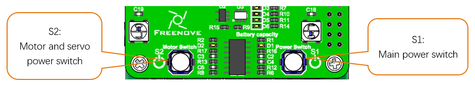

During the test, the motor will work. So you can disconnect the wheels or put it on the ground to avoid that it falls down and is damaged. Next, test RGB LED, motor, ultrasonic module, servo, etc. 

Button S1 is the Raspberry PI power supply switch. When you only press S1, you can perform other tests except motor and servo. 

Button S2 is the motor and servo power switch.  When you press S1 and S2, you can test the motor and servo.

:red:`You can still power Raspberry Pi with a power supply Cable when switches are pressed.`

If you have never learned python before, you can learn some basic knowledge via the link below: 

https://python.swaroopch.com/basics.html

Motor
*************************************
Run program

Before running the program, please make sure all needed libraries are installed; otherwise, the program will fail to run.

Open the terminal of Raspberry Pi. Enter the following commands to test the motor.

1. Use the cd command to enter the directory where test.py is located.

..  code-block:: console
    
    cd ~/Freenove_Tank_Robot_Kit_for_Raspberry_Pi/Code/Server

2. Execute test.py command:

..  code-block:: console
    
    sudo python test.py Motor

**Result:**

The car moves forward for 1 seconds, then moves back for 1 seconds, then turns left for 1 seconds, turns right for 1 seconds, then stops. You can press **"Ctrl + C"** to end the program ahead of time. :red:`If the car doesn't work normally, please check if both switches are pressed.`

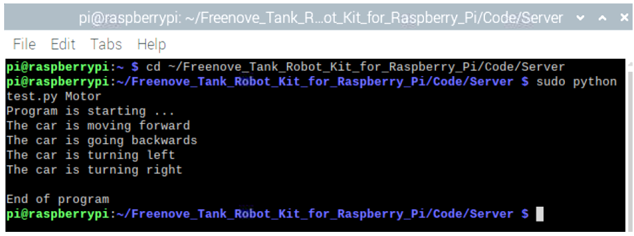

:red:`If the direction is reversed, it moves back then move forward, please exchange wiring of the two motors.`

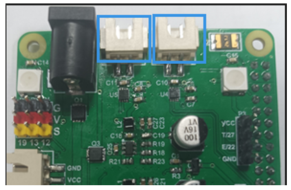

The code for motor in test.py is as below:

.. literalinclude:: ../../../freenove_Kit/Code/Server/test.py
    :language: python
    :lines: 42-64
    :linenos:

If you are interested in the underlying code, you can refer to motor.py for more details.

Reference
=====================================

.. py:function:: setMotorModel(data1,data2)	

    This function has two input parameters, which control the left motor and the right motor respectively. When the input parameter is in the range of 0~4095, the motor rotates forward. In the range of -4095~0, the motor rotates in reverse. The larger the absolute value, the faster the motor. When the input is 0, the motor will stop. If the function input is as follows: setMotorModel(2000,2000), the two motors will rotate forward and the car will move forward.

Infrared Line tracking module
*************************************

Run program
=====================================

Enter the following command in the terminal to test line tracking module.

If the terminal displays the directory as below (where test.py is located), you can directly execute the test.py command. 

1.	If not, execute the cd command:

..  code-block:: console
    
    cd ~/Freenove_Tank_Robot_Kit_for_Raspberry_Pi/Code/Server

2.	Execute test.py command:

..  code-block:: console
    
    sudo python test.py Infrared

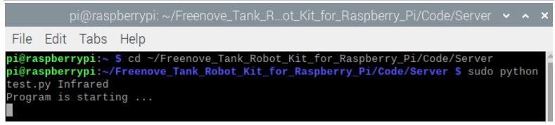

**Result:**

When the black tape is at the left of the sensor, it will print “Left” on the terminal; when it is at the middle, print “Middle”; and at the right, print “Right”. You can press “CTRL+C” to end the program.

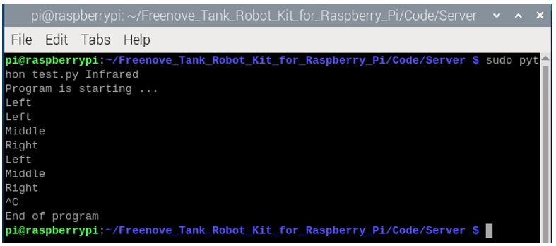

The code is as below:

.. literalinclude:: ../../../freenove_Kit/Code/Server/test.py
    :language: python
    :lines: 79-100
    :linenos:

you are interested in underlying code, please refer to infrared.py file.

Reference
=====================================

.. py:function:: GPIO.input(IO)	

    This function has an input parameter. If the IO input is high level, GPIO.input(IO) returns True. If the IO input is low level, GPIO.input(IO) returns False. 

LED
**************************************

There are 4 RGB LEDs on the smart car board, as shownbelow. You can control them separately. 

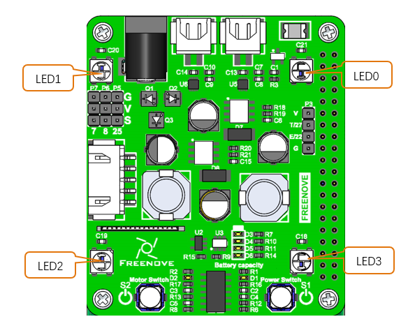

Run program
======================================

Enter the following commands to test LEDs.

If the terminal displays the directory as below (where test.py is located), you can directly execute the test.py command. 

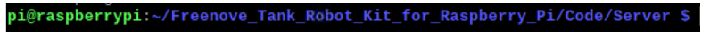

1.	If not, execute the cd command:

..  code-block:: console
    
    cd ~/Freenove_Tank_Robot_Kit_for_Raspberry_Pi/Code/Server

2.	Execute test.py command:

..  code-block:: console
    
    sudo python test.py Led

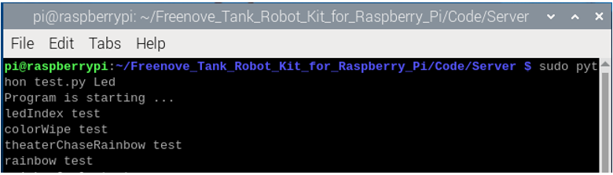

Note: On the board V1.0, the WS821x LEDs are connected to GPIO 18, which can be used on Raspberry Pi series 1-4, but not on Rpi 5.

On version 2.0, we connect them to GPIO10, which applies SPI interface, so it is compatible with Raspberry Pi series 1-5.

.. list-table:: 
    :header-rows: 1
    :align: center

    * - Tank Smart Car Board V1.0
      - Tank Smart Car Board V2.0

    * - |Chapter03_09|
      - |Chapter03_10|

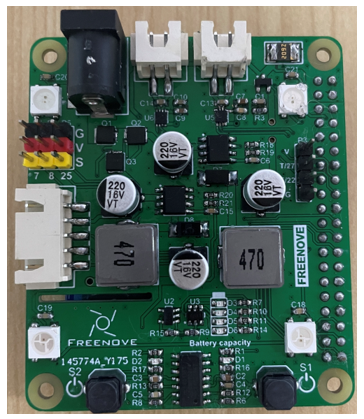
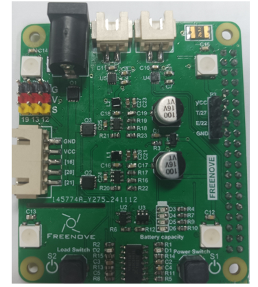

At the first time you run the code, the system will check your hardware version. Please enter the version according to the board you receive. You can refer to the images above to check the version.

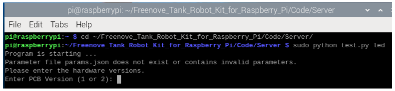

After you input the version (here we take verion 2 as an example), the LED test program will be run. If the LEDs do not respond, please check whether you type in a wrong version.

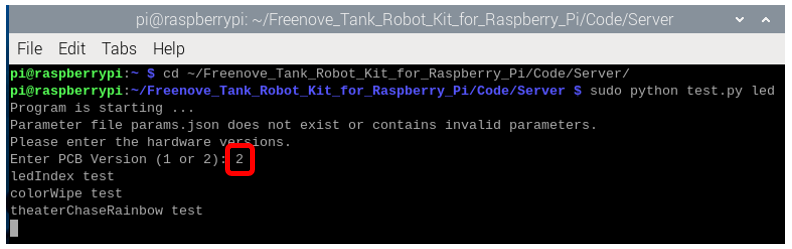

**Result:**

When the program is running, the LEDs will blink with different modes and colors. The order of the modes is: ledIndex->colorWipe->theaterChaseRainbow->rainbow->rainbowCycle

You can press CTRL+C to end the program.

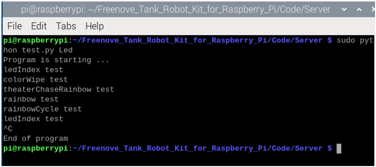

Note, the PCB version must be correctly input, which depends whether the code can run successfully. If you input a correct version, please follow the steps below to configure it again.

1.	Enter the directory /Freenove_Tank_Robot_Kit_for_Raspberry_Pi/Code/Server/, and run the parameter.py under Server folder.

..  code-block:: console
    
    cd ~/Freenove_Tank_Robot_Kit_for_Raspberry_Pi/Code/Server/
    sudo python parameter.py

2.	Input the number according to the board version.

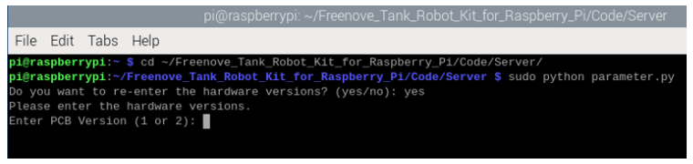

The code of test.py is as below:

.. literalinclude:: ../../../freenove_Kit/Code/Server/test.py
    :language: python
    :lines: 10-40
    :linenos:

If you are interested in the underlying code, you can check the led.py file.

Servo 
******************************

Run program
===============================

Enter the following commands in the terminal to test servos.

If the terminal displays the directory as below (where test.py is located), you can directly execute the test.py

command.

1. If not, execute the cd command:
   
..  code-block:: console
    
    cd ~/Freenove_Tank_Robot_Kit_for_Raspberry_Pi/Code/Server

2. Execute test.py command:

..  code-block:: console
    
    sudo python test.py Servo

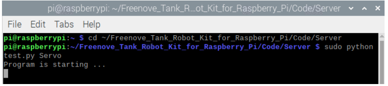

If your Raspberry pie is not Pi5 and your PCB version is V1.0, run the following command before running the servo.py.

..  code-block:: console
    
    sudo pigpiod

If you want to end the pigpio process, run the following command.

..  code-block:: console
    
    sudo killall pigpiod

The servo will repeat the following: servo 0 is closed gradually, servo 1 from top to bottom, and then from bottom to top, servo 0 is opened gradually.  You can press Ctrl + C to end the program.

When testing servo steering gear, you need to observe whether servo 0 is closed to the minimum, whether servo 1 hits the ground during the descent, 

When servo 0 is just closed to the minimum and servo 1 drops close to the ground without touching the ground, it means that your servo 0 and servo 1 are properly installed. 

When other conditions occur, please check that the installation steps of the relevant servo are correct.

For details, see Step 24 in :ref:`Chapter 2<fnk0077/codes/tutorial/2_assemble_smart_car_:chapter 2 assemble smart car>`.

The code is as below: 

.. literalinclude:: ../../../freenove_Kit/Code/Server/test.py
    :language: python
    :lines: 102-124
    :linenos:

Reference
===============================

.. py:function:: setServoAngle(Servo,angle)	

    There are 2 parameters.

    The first one is related to servo index.

    The second one is related to the angle of servos. 

    For example,

    setServoAngle ('0',90) makes servo0 rotate to 90°.

    setServoAngle ('1',90) makes servo1 rotate to 90°.

Ultrasonic module
*********************************

Next, use jumper wires F/F to connect ultrasonic module with pins on smart car board.

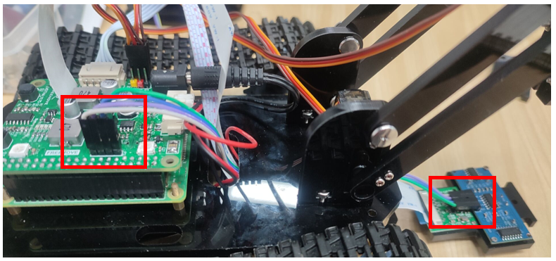

When connecting the ultrasonic module, you should keep the silk screen of the ultrasonic module and the smart car board consistent. Vcc should be connected to 5V, Trig to TRIG, Echo to ECHO, and Gnd to GND.

If the connection is wrong, for example, if Vcc is connected to GND, and Gnd is connected to 5V, it will cause the damage to ultrasonic module. After the wiring is completed, you can start testing.

Run program
==================================

Enter following command in the terminal:

If the terminal displays the directory as below (where test.py is located). You can directly execute the test.py command. 

1.	If not, execute the cd command:

..  code-block:: console
    
    cd ~/Freenove_Tank_Robot_Kit_for_Raspberry_Pi/Code/Server

2.	Execute test.py command:

..  code-block:: console
    
    sudo python test.py Ultrasonic

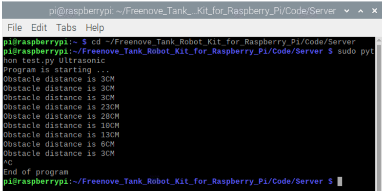

**Result:**

Every 0.3s, the distance between the obstacle and the ultrasonic module will be printed out, and you can press "Ctrl + C" to end the program.

The code is as below:

.. literalinclude:: ../../../freenove_Kit/Code/Server/test.py
    :language: python
    :lines: 66-77
    :linenos:

Reference
=================================

.. py:function:: get_distance()	

    This function is used to obtain the distance between ultrasonic module and obstacles in front of it, with unit CM.

Camera 
********************************

Next let us connect the camera to smart car board. 

First turn off S1 (Power Switch) and S2, shut down Raspberry Pi and disconnect power cable. If the data cable is used to power the Raspberry Pi, disconnect the data cable and install the CSI camera to the Raspberry Pi camera interface when the Raspberry Pi is powered off. 

The CSI camera must be connected or disconnected under no power and when Raspberry Pi is shut down, or the camera may be burned.

Run Program
===============================

If the terminal displays the directory as below, you can directly run the Led.py.

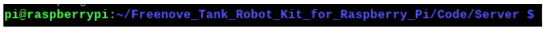

1. If not, execute the cd command:

..  code-block:: console
    
    cd ~/Freenove_Tank_Robot_Kit_for_Raspberry_Pi/Code/Server

2. Execute test.py command:

..  code-block:: console
    
    sudo python test.py camera

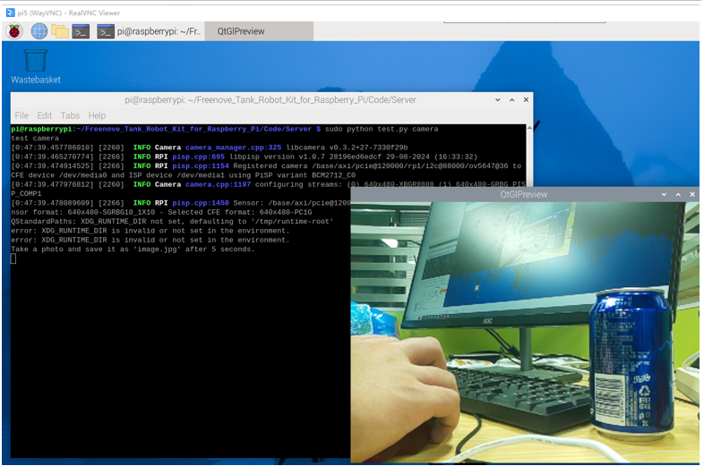

Results:

Five seconds after the program runs, it will take a picture in jpg format and save it to the current directory. You can run the ls command to see if it is there.

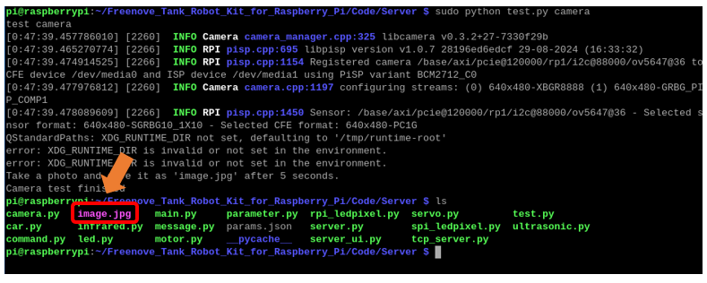

Part of code is as below:

.. literalinclude:: ../../../freenove_Kit/Code/Server/test.py
    :language: python
    :lines: 126-136
    :linenos: