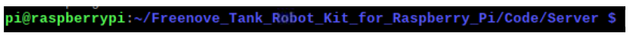
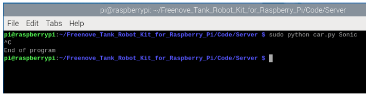

##############################################################################
Chapter 4 Ultrasonic Obstacle Avoidance Car 
##############################################################################

If you have any concerns, please feel free to contact us via support@freenove.com

Description
*****************************

The obstacle avoidance function of the vehicle mainly uses HC-SR04 ultrasonic module. The ultrasonic module will detect the distance between obstacles and the robot in real time, and then control the tank robot to move according to different distances.

Run program
=============================

If the terminal displays the directory as below, you can directly run the Ultrasonic.py.

1.	If not, execute the cd command:

..  code-block:: console
    
    cd ~/Freenove_Tank_Robot_Kit_for_Raspberry_Pi/Code/Server

2.	Run the ultrasonic program.

..  code-block:: console
    
    sudo python car.py Sonic

You can press "Ctrl + C" to end the program.

Part of code is as below:

.. literalinclude:: ../../../freenove_Kit/Code/Server/car.py
    :language: python
    :lines: 53-70
    :linenos:

Result analysis
==========================

When the tank robot detects that the distance between the obstacle and the car is less than 45cm, it will successively retreat for a period of time and then turn left for a period of time. When the robot detects that the distance between the obstacle and the robot is greater than or equal to 45cm, it will move forward.

:red:`In addition, you need to pay attention to the following:`

In obstacle avoidance mode, only a single ultrasonic module is used for recognition, so in this mode, you need to observe the movement of the car. When the car is misidentified, please stop the car as soon as possible or pick up the car and place it in an open space. Otherwise, the car's manipulator servo could be damaged due to a collision, and may even burn your Raspberry PI expansion board or your raspberry PI.