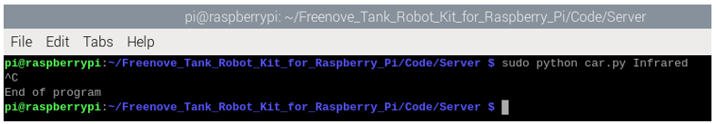

##############################################################################
Chapter 5 Infrared tracking automatic wrecker 
##############################################################################

If you have any concerns, please feel free to contact us via support@freenove.com

Description
**********************************

The circuit tracking function of the tank robot mainly uses infrared module. When the sensor detects a black line, the corresponding LED lights up to control the tank robot's movement according to the values of the three sensors. The tank robot detects whether there are obstacles on the road through the ultrasonic sensor while finding the line. When there are obstacles, the tank robot starts the obstacle clearing function. After the obstacle is cleared, the tank robot continues to find the line.

Run program
==================================

If the terminal displays the directory as below, you can directly run the program.

1.	If not, execute the cd command:

..  code-block:: console
    
    cd ~/Freenove_Tank_Robot_Kit_for_Raspberry_Pi/Code/Server

2.	Run the infrared car program.

..  code-block:: console
    
    sudo python car.py Infrared

If your Raspberry pie is not Pi5 and your PCB version is V1.0, run the following command before running the code.

..  code-block:: console
    
    sudo pigpiod

If you want to end the pigpio process, run the following command.

..  code-block:: console
    
    sudo killall pigpiod

You can press "Ctrl + C" to end the program.

Before running the project, you should use black tape to make a suitable closed track, place the car on the track after the completion of the production, and then run the relevant code. After 1.5S, the car will start the function of automatically removing obstacles.

When the car is in the task, you need to observe the movement of the car, when the car runs out of the designated track, should stop the car or put the car on the original designated track.

The code is as below:

.. literalinclude:: ../../../freenove_Kit/Code/Server/car.py
    :language: python
    :lines: 72-112
    :linenos:

Result analysis
==================================

The car has the functions of line inspection and automatic obstacle clearance.  The specific realization of the car's line inspection function is as follows: 

There are three sensors on the left, center and right.  When the black line is detected by the sensor, it will display a high level, or it is low.  When the sensor left: high, middle: low, right: low, the car gently turns left.  When the sensor is left: high, middle: high, right: low, the car turns left.  When the sensor left: low, medium: high, right: low, the car goes straight.  When the sensor left: low, medium: low, right: high, the car gently turns right.  When the sensor is left: low, middle: high, right: high, the car turns right. 

The car's automatic obstacle clearance function is as follows: under the condition of line inspection, the car detects whether there are obstacles in front of the car in real time through the ultrasonic module.  When the car detects obstacles in front of the car, the car stops and removes the obstacles through the steering gear.  After clearing, the car continues to perform the function of line inspection.