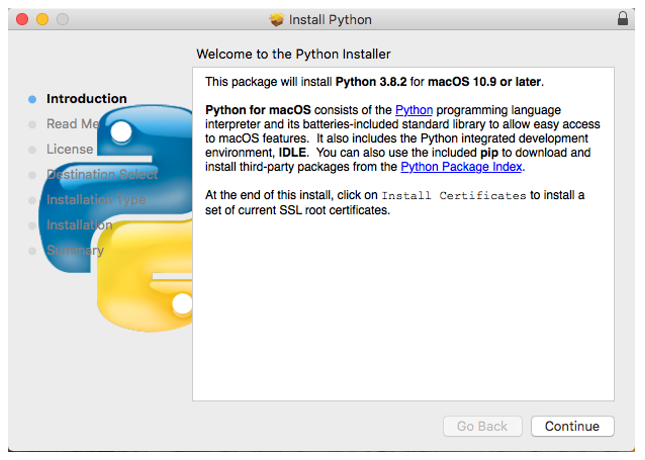

##############################################################################
Chapter 6 Smart video car
##############################################################################

If you have any concerns, please feel free to contact us via support@freenove.com

The smart video car integrates the previous functions of obstacle avoidance, line tracking and obstacle clearing, video transmission, ball tracking, LED and so on. It consists of a server and a client, so it can be controlled remotely.

Server
*****************************

Open Server
============================

Enter the following command in the terminal.

1.	Use cd command to enter directory where main.py is located:

.. code-block:: console
    
    cd ~/Freenove_Tank_Robot_Kit_for_Raspberry_Pi/Code/Server

2.	Run main.py:

.. code-block:: console
    
    sudo python main.py

If your Raspberry pie is not Pi5 and your PCB version is V1.0, run the following command before running the code.

.. code-block:: console
    
    sudo pigpiod

If you want to end the pigpio process, run the following command.

.. code-block:: console
    
    sudo killall pigpiod

The interface is as below:

The Server is ON when the code is run. To turn it off, you can click the “Off” button. 

To exit the server, you can close the server interface or run CTRL+C on the Terminal.

:red:`If you are very interested in the implementation of the code, you can view the code:`

:red:`Freenove_Tank_Robot_Kit_for_Raspberry_Pi/Code/Server`

Sever Auto Start 

1. Open the terminal and execute the following two commands respectively to create a “start.sh” file.

.. code-block:: console
    
    cd ~
    sudo touch start.sh

2. Open “start.sh”.

.. code-block:: console
    
    sudo nano start.sh

3. Add the following contents to “start.sh” file.

.. code-block:: shell
    
    #!/bin/sh
    cd "/home/pi/Freenove_Tank_Robot_Kit_for_Raspberry_Pi/Code/Server"
    pwd	    
    sleep 10
    sudo python main.py

Press Ctrl + O and then press Enter to save it. Press Ctrl+X to exit.

4. Modify permissions.

.. code-block:: console
    
    sudo chmod 777 start.sh

5. Enter the following command to create a directory.

.. code-block:: console
    
    mkdir ~/.config/autostart/

6. create and open “start.desktop” file

.. code-block:: console
    
    sudo nano .config/autostart/start.desktop

7. Add the following content to “start.desktop” file.

.. code-block:: shell
    
    [Desktop Entry]
    Type=Application
    Name=start
    NoDisplay=true
    Exec=/home/pi/start.sh

Press Ctrl + O and then press Enter to save it. Press Ctrl+X to exit.

8. Modify permissions.

.. code-block:: console
    
    sudo chmod +x .config/autostart/start.desktop

9. Finally enter the following content to reboot Raspberry Pi.

.. code-block:: console
    
    sudo reboot

.. note:: 
    
    To cancel auto start, please delete the files “start.sh” and “start.desktop” created above.

Client
*******************************

The client connects to the server through TCP, which receives the video stream and other commands from the server. And it also sends commands to the server to control the car. 

Clients can run on different systems such as windows, macOS, and Linux. You need to install related software and libraries.

Run client on windows system
================================

There are two ways to run Client on Windows. 

Option 1 Running executable file directly
---------------------------------------------------

Find the “Client.exe” file in the specified directory, double click it and the Client is opened. 

.. image:: ../_static/imgs/6_Smart_video_car_/Chapter06_04.png
    :align: center

The client interface is shown as below:

After the client opens successfully, you need open the Raspberry Pi and open server first, then enter the IP address of the Raspberry Pi in the white IP edit box, and then click “Connect” to connect smart car to Raspberry Pi. After the connection is successful, you can click on the controls on the interface to operate the car.

.. note::
    
    :red:`when Raspberry Pi is shut down, server will be closed. You need open server again the next time.`

:red:`If pressing forward but the car moves backward, please refer to page 66 to modify the code.`

The control interface of tank robot tracking ball is as follows:

Choose the color of the ball in your hand, take the Red ball as an example, when you click the button "red", into the tank robot tracking red ball control program, when your environment is poor recognition of red, you can click "Custom", by adjusting the HSV parameters to adjust the accuracy of recognition, 

This recognition program is for color recognition, can track red objects not limited to red ball.

When the car motion control is abnormal, you can click the color button again to make the car stop moving.

After the color threshold is displayed, the recognition effect can be observed and the appropriate data can be selected according to the following HSV color range table to improve the recognition accuracy.

The HSV color range is listed below:

+-----+-------+------+-------+---------+--------+--------+-------+------+------+--------+
|     | black | gray | white |   red   | orange | yellow | green | cyan | blue | purple |
+=====+=======+======+=======+====+====+========+========+=======+======+======+========+
| H-  | 0     | 0    | 0     | 0  |156 | 11     | 26     | 35    | 78   | 100  | 125    |
+-----+-------+------+-------+----+----+--------+--------+-------+------+------+--------+
| H+  | 180   | 180  | 180   | 10 |180 | 25     | 34     | 77    | 99   | 124  | 155    |
+-----+-------+------+-------+----+----+--------+--------+-------+------+------+--------+
| S-  | 0     | 0    | 0     | 43      | 43     | 43     | 43    | 43   | 43   | 43     |
+-----+-------+------+-------+---------+--------+--------+-------+------+------+--------+
| S+  | 255   | 43   | 30    | 255     | 255    | 255    | 255   | 255  | 255  | 255    |
+-----+-------+------+-------+---------+--------+--------+-------+------+------+--------+
| V-  | 0     | 46   | 221   | 46      | 46     | 46     | 46    | 46   | 46   | 46     |
+-----+-------+------+-------+---------+--------+--------+-------+------+------+--------+
| V+  | 46    | 220  | 255   | 255     | 255    | 255    | 255   | 255  | 255  | 255    |
+-----+-------+------+-------+---------+--------+--------+-------+------+------+--------+

Using red as an example, set HSV to the following:

[H-, S-, V-, H+, S+, V+] [0, 118, 31, 6, 255, 255]

You can adjust the value range to make the tracking better.

Option 2 Install python3 and some related python libraries to run the client 
------------------------------------------------------------------------------------

If you want to modify the client, please follow this section.

This section will be completed in your **computer with windows system,** :red:`not Raspberry Pi.`

There are many relevant software and libraries needed to be installed in Windows system, which takes a long time. At this time, it does not need to run Server or use Raspberry Pi. You can shut down Raspberry Pi first. After the installation is completed, you need to open Raspberry Pi and server again.

Install python3
--------------------------------

Download the installation file:

https://www.python.org/downloads/windows/

Click Latest Python 3 Release - Python 3.8.1

Choose and download Windows x86 executable installer. After downloading successfully, install it.

Select “Add Python 3.8 to PATH”. You can choose other installation features.

Select all options and click “Next”.

Here, my install location is D. You can also choose other location. Then click “Install”.

Wait installing.

Now, installation is completed.

Install PyQt5、opencv、numpy and other libraries.
----------------------------------------------------------------

If have not download the zip file, do so via:

https://github.com/Freenove/Freenove_Tank_Robot_Kit_for_Raspberry_Pi/archive/master.zip

Then unzip it and delete “-master” to rename it to “Freenove_Tank_Robot_Kit_for_Raspberry_Pi”.

Then put it into D disk for example.

You can also place it into other disks (like E), but the path in the following command should be modified accordingly (replace D: by E:).

Press “win + R” and enter cmd, and click ok. Then enter following commands.

1.	Enter D disk. (If you put it into E, it should be E:)

.. code-block:: console
    
    D:

2.	Enter directory where setup_windows.py is located: (If you put it into E, it should be E:)

.. code-block:: console
    
    cd D:\\Freenove_Tank_Robot_Kit_for_Raspberry_Pi\\Code

3.	Run setup_windows.py:

.. code-block:: console
    
    python3 setup_windows.py

Or enter the unzipped directory Freenove_Tank_Robot_Kit_for_Raspberry_Pi\\Code\\Client. 

If your python3 fails to execute, you can try using python with the following command:

.. code-block:: console
    
    python setup_windows.py

And double-click **setup_client.py** or open it with python3.

Installation will take some time. Just wait patiently. For successful installation, it will prompt "All libraries installed successfully": 

If not all installations are successful, it will prompt "Some libraries have not been installed yet. Please run ' Python3 setup_windows.py ' again", then you need to execute the Python3 setup_windows.py command again. Most of the installation failures are caused by poor networks. You can check your network before installing.

Open client
---------------------------

Press “win + R” and enter cmd, and click ok. Then enter following commands.

1.	Enter D disk. If you put it into E, it should be E:

.. code-block:: console
    
    D:

2.	Enter directory where Main.py is located:

.. code-block:: console
    
    cd D:\Freenove_Tank_Robot_Kit_for_Raspberry_Pi\\Code\\Client

3.	Run Main.py:

.. code-block:: console
    
    python Main.py

Or enter the unzipped directory and enter following directory: 

Freenove_Tank_Robot_Kit_for_Raspberry_Pi\\Code\\Client. And double-click **Main.py** or open it with python to open the client.

The client interface is shown as below:

After the client opens successfully, you need open the Raspberry Pi and  open server first, then enter the IP address of the Raspberry Pi in the white IP edit box, and then click “Connect” to connect smart car to Raspberry Pi. After the connection is successful, you can click on the controls on the interface to operate the car.

.. note::
    
    :red:`when Raspberry Pi is shut down, server will be closed. You need open server again the next time.`

:red:`If pressing forward but the car moves backward, please refer to page 63 to modify the code.`

Control
------------------------------------

And you can also control the car with following blue keys. 

The car has three work modes:

+-----------------+-------------------------------------------------------+
|      Mode       |                       Function                        |
+=================+=======================================================+
| M-Free  (Mode1) | Free control mode                                     |
+-----------------+-------------------------------------------------------+
| M-Sonic (Mode2) | Ultrasonic obstacle avoidance mode                    |
+-----------------+-------------------------------------------------------+
| M-Line  (Mode3) | Infrared tracking automatically clears obstacles mode |
+-----------------+-------------------------------------------------------+

The following is the corresponding operation of the buttons and keys.

+-------------------------+-------------+---------------------------+
|    Button on Client     |     Key     |          Action           |
+=========================+=============+===========================+
| ForWard                 | W           | Move                      |
+-------------------------+-------------+---------------------------+
| BackWard                | S           | Back off                  |
+-------------------------+-------------+---------------------------+
| Turn Left               | A           | Turn left                 |
+-------------------------+-------------+---------------------------+
| Turn Right              | D           | Turn right                |
+-------------------------+-------------+---------------------------+
| Left                    | left arrow  | Turn camera left          |
+-------------------------+-------------+---------------------------+
| Right                   | right arrow | Turn camera right         |
+-------------------------+-------------+---------------------------+
| Up                      | up arrow    | Turn camera up            |
+-------------------------+-------------+---------------------------+
| Down                    | down arrow  | Turn camera down          |
+-------------------------+-------------+---------------------------+
| Home                    | Home        | Turn camera back Home     |
+-------------------------+-------------+---------------------------+
| Connect/ Disconnect     | C           | On/off Connection         |
+-------------------------+-------------+---------------------------+
| Open Video/ Close Video | V           | On/off Video              |
+-------------------------+-------------+---------------------------+
| Led_Mode 1,2,3,4        | L           | Switch Led Mode           |
+-------------------------+-------------+---------------------------+
| The car work modes      | Q           | Switch the car work modes |
+-------------------------+-------------+---------------------------+
| Pinch_Object            | O           | Pinch Object              |
+-------------------------+-------------+---------------------------+
| Drop_Object             | P           | Drop Object               |
+-------------------------+-------------+---------------------------+

The function of SliderBar is below:

+------------+--------------------------------------------------------+
| SliderBar  |                        Function                        |
+============+========================================================+
| Servo 1,2, | SliderBar Servo 1, 2 are used to slightly adjust       |
|            |                                                        |
|            | the angle. you can slightly tune it via the SliderBar. |
+------------+--------------------------------------------------------+

Other control information:

+---------------------+------------------------------------+
|       Control       |              Function              |
+=====================+====================================+
| IP address Edit box | Enter IP address of Raspberry Pi   |
+---------------------+------------------------------------+
| R,G,B Edit box      | Control the color of LED selected. |
+---------------------+------------------------------------+
| Button “Ultrasonic“ | Show the distance from obstacle.   |
+---------------------+------------------------------------+

When you enter the IP address for the first time, the program saves the IP address. When you close the program and open the program again, the program automatically fills in the last IP address. The IP address is saved in the “IP.txt” file.

When you run the program for the first time, the contents of the "IP.txt" file are: "IP address", then the program page is opened as follows:

After you enter the address, for example, 192.168.1.147, close the program and open the program page again as follows:

Run client on macOS system
====================================

Here take MacOS 10.13 as an example. To run the client on MacOS, you need to install some software and libraries. At this time, it does not need to run the server or use the Raspberry Pi. So you can turn off the Raspberry Pi first. After the installation is complete, turn on the Raspberry Pi and run the server. MacOS 10.13 comes with python2, but no python3. However, the programs in this project need run under python3, so you need to install it first.

Install python3
--------------------------------

Download installation package, link: https://www.python.org/downloads/

If your macOS is 11. Like 11.0, please install :red:`python 3.9`.

If your macOS is NOT 11, like 10.15, please install :red:`python 3.8`. :purple:`If you have installed python 3.9. You need uninstall it first.`

At bottom of the page, click macOS 64-bit installer and download installation package.

Click Continue.

Click Continue

Click Agree.

Click Install. If your computer has a password, enter the password and Install Software.

Now the installation succeeds.

You can find it in Aapplications.

Install PyQt5、opencv、numpy and other libraries
-------------------------------------------------------

If there is no code for this car in your macOS system device, you can download it via the link below:

https://github.com/Freenove/Freenove_Tank_Robot_Kit_for_Raspberry_Pi/archive/master.zip

After downloaded successfully, you can find it under Downloads.

Open the Terminal.

Type following commands in Terminal.

1. Enter “Downloads“, (Where the Car code is located. If your location for it is different, please enter the location in your device.)

.. code-block:: console
    
    cd Downloads

2. Enter directory where setup_macos.py is located:

.. code-block:: console
    
    cd Freenove_Tank_Robot_Kit_for_Raspberry_Pi/Code/

3. Run setup_macos.py:

.. code-block:: console
    
    python3 setup_macos.py

Installation will take some time. Just wait patiently. For successful installation, it will prompt "All libraries installed successfully":

If not all installations are successful, it will prompt "Some libraries have not been installed yet. Please run 'python3 setup_macos.py' again", then you need to execute the python3 setup_macos.py command again. Most of the installation failures are caused by poor networks. You can check your network before installing.

If you are using macOS under 11.0, like 10.15. Just skip to “Open client”. 

If you are using macOS 11.0 or later version. Please run commands below:

.. code-block:: console
    
    pip3 uninstall PyQt5
    pip3 install PyQt5

Open client
-------------------------------------------------------

Following the previous step, after the installation is completed, you are now in the directory where setup_macos.py is located.

1.Type following command to enter Client folder.

.. code-block:: console
    
    cd Client/

2.Type following command to run Main.py.

.. code-block:: console
    
    python3 Main.py

The control way of Raspberry Pi macOS System client is same with Windows (:ref:`Control <fnk0077/codes/tutorial/6_smart_video_car_:control>`).

Run client in Raspberry Pi (Linux system)
=======================================================

Install Opencv library
---------------------------------------

Execute the following commands in the terminal to install Opencv library:

1.	Install opencv development environment:

.. code-block:: console
    
    sudo apt-get install -y libopencv-dev python3-opencv

2.	Install some tools:

.. code-block:: console
    
    sudo apt-get install -y  python3-pil python3-tk

Run client
---------------------------------------

Enter the following commands at the terminal.

1.	Use the cd command to go to the directory where Main.py is located.

.. code-block:: console
    
    cd ~/Freenove_Tank_Robot_Kit_for_Raspberry_Pi/Code/Client

2.	Run Main.py:

.. code-block:: console
    
    sudo python Main.py

The interface is shown below:

The control mode of client on Linux is the same as that of Windows.

**If the image is not clear, please check whether the camera protective film is torn off.**

Trouble shooting
========================================

**If the car works abnormally, it may be caused by following reasons: raspberry pi system is stuck or batteries have no power.**

You need check batteries power indicator or recharge batteries.

If the batteries are OK, raspberry pi system is stuck. You need wait some time to check if the client works. Or reopen the server and client. 

The latest Raspberry Pi official system is not stable. It occasionally is stuck. The old version is more stable.

If the raspberry pi system is stuck for a long time, you need reboot raspberry pi.

If you have any concerns, please feel free to contact us with pictures: 

support@freenove.com

Android and iOS app
*****************************************

You can download and install the Freenove Android app from below:

On Google play:

https://play.google.com/store/apps/details?id=com.freenove.suhayl.Freenove

On GitHub:

https://github.com/Freenove/Freenove_App_for_Android

In this github repository, you can find the App instruction (Tutorial.pdf).

You can download and install the Freenove **iPhone ios app** by searching freenove in app store.

Open the app and select the car.

Open the server in Raspberry Pi car first. And enter your Pi IP. 

Free innovation
****************************************

**If you have any concerns, please feel free to contact us via** support@freenove.com

If you want to write your own program to control the car, just follow this section. We will teach you how to program this car. 

If you have never learned python before, you can learn some basic knowledge via the link below: 

https://python.swaroopch.com/basics.html

First, turned on S1 and S2. Then open Raspberry Pi, right click and create a new folder on the desktop: Test

Open Freenove_Tank_Robot_Kit_for_Raspberry_Pi/Code/Server in your Raspberry Pi and copy the following **5 files** into the Test folder we created.

Paste them in Test folder.

Run Thonny Python IDE

Click Save and save it into the Test folder, with name: test_Code.

Now you can see the file test_Code.py we created.

Then write code in test_Code.py, then click save.

.. note::
    
    :red:`the code and library are written by Python 3. You need execute the code with python 3.`

Open the terminal and use the following command to enter the directory where test_Code.py is located:

.. code-block:: console
    
    cd ~/Desktop/Test

Run test_Code.py:

.. code-block:: console
    
    sudo python  test_Code.py

Code example
========================================

Following are code example for the parts. For more detail, please refer to Module test section.

For more details, please refer to :ref:`Motor <fnk0077/codes/tutorial/3_module_test_(necessary):motor>`

.. code-block:: python
    :linenos:

    from Motor import *                       #import Motor
    PWM=Motor()                               #create an object
    PWM.setMotorModel(2000,2000)              #Forward
    print("The car is moving forward")
    time.sleep(3)                             #waiting 3 second
    PWM.setMotorModel(0,0)                    #Stop

LED. For more details, please refer to :ref:`LED <fnk0077/codes/tutorial/3_module_test_(necessary):led>`

.. code-block:: python
    :linenos:

    from Led import *                       #import Led     
    led=Led()                               #create an object
    led.ledIndex(0x04,255,255,0)            #yellow
    led.ledIndex(0x80,0,255,0)              #green
    time.sleep(5)                           #wait 5s
    led.colorWipe(led.strip, Color(0,0,0))  #turn off

Servo. For more details, please refer to :ref:`Servo <fnk0077/codes/tutorial/3_module_test_(necessary):servo>`

.. code-block:: python
    :linenos:

    from servo import *   #import Led
    pwm = Servo()           #create an object
    #Servo rotates from 90 degrees to 150 degrees
    for i in range(90, 150, 1) :
        pwm.setServoPwm('0', i)
        time.sleep(0.01)
    #Servo rotates from 140 degrees to 90 degrees
    for i in range(145, 90, -1) :
        pwm.setServoPwm('0', i)
        time.sleep(0.01)

Ultrasonic module. For more details, please refer to :ref:`Ultrasonic module <fnk0077/codes/tutorial/3_module_test_(necessary):ultrasonic module>`.

.. code-block:: python
    :linenos:

    from Ultrasonic import *         #import Led 
    ultrasonic=Ultrasonic()          #create an object            
    data=ultrasonic.get_distance()   #Get the value
    print ("Obstacle distance is "+str(data)+"CM")

These codes can be integrated into one code to achieve your requirement. 