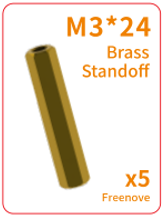

##############################################################################
List
##############################################################################

If you have any concerns, please feel free to contact us via support@freenove.com

Machinery Parts
******************************************

.. list-table:: 

    * - |List00| 
      - |List01|
      - |List02|
      - |List03|
      - |List04|

    * - |List05| 
      - |List06|
      - |List07|
      - |List08|
      - |List09|

    * - |List10| 
      - |List11|
      - |List12|
      - |List13|
      - |List14|

Transmission Parts
******************************************

.. list-table:: 

    * - Track drive wheels x2
      - Track follower wheels x2

    * - |List15|
      - |List16|

    * - Servo package x2
      - Track x2

    * - |List17|
      - |List18|

    * - DC speed reduction motor x2
        
        :red:`Do NOT remove the cable tie on the motor!`

      - Motor bracket bag  x2

    * - |List19|
      - |List20|

Acrylic Parts
**********************************

Electronic Parts
****************************************

+-------------------------+-----------------------------+------------------------------+
| Line tracking module x1 | Camera x1(OV5670 or imx219) | HC-SR04 Ultrasonic           |
|                         |                             |                              |
|                         |                             | Module x1                    |
|                         |                             |                              |
| |List22|                | |List23|                    | |List24|                     |
+-------------------------+-----------------------------+------------------------------+
| Jumper Wire F/F(4) x1                                                                |
|                                                                                      |
| |List25|                                                                             |
+-------------------------+-----------------------------+------------------------------+
| XH-2.54-5Pin cable x1                                                                |
|                                                                                      |
| |List26|                                                                             |
+-------------------------+-----------------------------+------------------------------+
| FPC cable x1                                                                         |
|                                                                                      |
| |List27|                                                                             |
+-------------------------+-----------------------------+------------------------------+

Tools
*******************************************

+------------------------------+----------------------------+
| Cross screwdriver (3mm) x1   | Black tape x1              |
|                              |                            |
| |List28|                     | |List29|                   |
+------------------------------+----------------------------+
| Cable Tidy x20cm             | Red ball x1                |
|                              |                            |
| |List30|                     | |List31|                   |
+------------------------------+----------------------------+
| Cross screwdriver (2mm) x1   | Aluminum alloy coupling x2 |
|                              |                            |
| |List32|                     | |List33|                   |
+------------------------------+----------------------------+
| internal hexagonal wrench x1                              |
|                                                           |
| |List34|                                                  |
+-----------------------------------------------------------+

Self-prepared Parts
************************************

+-------------------------------------------------------------------------------------------------+
| 2X 3.7V 18650 lithium :red:`rechargeable` batteries with continuous discharge current > 3A.     |
|                                                                                                 |
| **It is easier to find proper battery on eBay than Amazon. Search “18650 high drain” on eBay.** |
|                                                                                                 |
| |List35|                                                                                        |
+-------------------------------------------------------------------------------------------------+
| Raspberry Pi ( :red:`Recommended model: Raspberry 5 / 4B / 3B+` ) x1                            |
|                                                                                                 |
| |List36|                                                                                        |
+-------------------------------------------------------------------------------------------------+
 

Tank Smart Car Board for Raspberry Pi
*****************************************

.. note:: 
    
    The images of the car board may look different from the one you receive (V1.0 or V2.0). By the way, the interface design of the two version is the same, so the operation on them are the same. You can just follow this book to use it.

+---------------------------+---------------------------+
| Tank Smart Car Board V1.0 | Tank Smart Car Board V2.0 |
|                           |                           |
| |List37|                  | |List38|                  |
+---------------------------+---------------------------+

